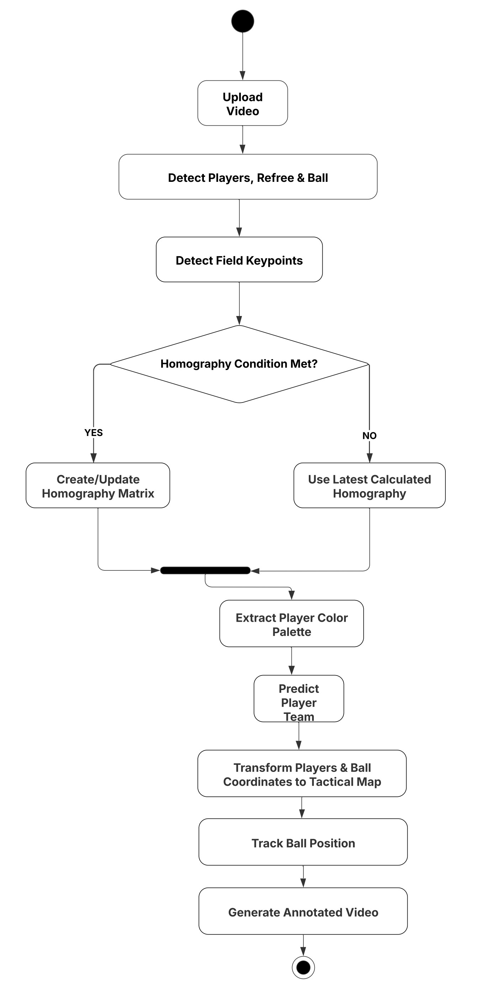

# Football Match Analysis Using YOLOv8 Models

## About The Project
This project is a combination of player detection and keypoint detection models built using Yolov8 Models , aimed at detecting specific points in images for Analysis of Football Matches/ Clips. It uses annotated bounding boxes to improve precision. A football clip 200Mb or less can be uploaded and annotated video can be obtained.

## Features
1. Determine Player,Ball and Refree Positions.
2. Determine Field Keypoints.
3. Show all the above objects in a Tactical Map.
4. Record Ball Trajectory.
5. Stats Generation Capability.

## Tech Stack
 * Python
 * OpenCV
 * Pytorch
 * NumPy
 * Streamlit
 * Ultralytics

 ## Installation / Usage
1. Clone the github repository.
2. Install the required dependecies listed on requirements.txt.
```
pip install -r requirements.txt
```
3. Run the script with 
```
streamlit run app.py
```

## How it Works



